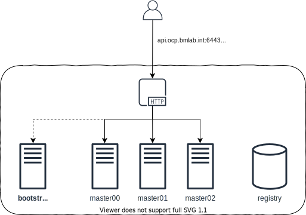

= Openshift 4

Deploy Openshift 4 on libvirt using Terraform without Internet access.

== Requirements

- Libvirt 5.6.0+
- Terraform 0.12.25+
- Libvirt provider for Terraform 0.6.2+

=== Install libvirt

Install libvirt following https://docs.fedoraproject.org/en-US/quick-docs/getting-started-with-virtualization/index.html[official documentacion].

=== Install requirements

The `+requirements.sh+` will install all needed requirements.

[source,bash]
----
make requirements
----

=== Fedora CoreOS image

Download FCOS image.

[source,bash]
----
curl --output /tmp/fedora-coreos-31.20200310.3.0-qemu.x86_64.qcow2.gz \
    https://builds.coreos.fedoraproject.org/prod/streams/stable/builds/31.20200310.3.0/x86_64/fedora-coreos-31.20200310.3.0-qemu.x86_64.qcow2.xz
----

Extract image content in libvirt images folder.

[source,bash]
----
unxz -c /tmp/fedora-coreos-31.20200310.3.0-qemu.x86_64.qcow2.gz > \
    /var/lib/libvirt/images/fedora-coreos-31.20200310.3.0-qemu.x86_64.qcow2
----

=== Red Hat CoreOS image

Download RHCOS image.

[source,bash]
----
curl --output /tmp/rhcos-4.3.8-x86_64-qemu.x86_64.qcow2.gz \
    https://mirror.openshift.com/pub/openshift-v4/dependencies/rhcos/4.3/latest/rhcos-4.3.8-x86_64-qemu.x86_64.qcow2.gz
----

Extract image content in libvirt images folder.

[source,bash]
----
gunzip -c /tmp/rhcos-4.3.8-x86_64-qemu.x86_64.qcow2.gz > \
    /var/lib/libvirt/images/rhcos-4.3.8-x86_64-qemu.x86_64.qcow2
----

== Setup Libvirt

Use `+virsh+` command utility to configure libvirt.

[source,bash]
----
export LIBVIRT_DEFAULT_URI="qemu:///system"
----

Check if libvirt is running.

[source,bash]
----
virsh version --daemon
----

=== QEMU permissions

The provider does not currently support to create volumes with different mode than `+root:root+` so QEMU agent must run as priviledged. Set user and password in `+/etc/libvirt/qemu.conf+` file.

[source,bash]
----
...
user = "root"
group = "root"
...
----

Restart libvirt daemon.

[source,bash]
----
systemctl restart libvirtd
----

== Deploy cluster

Export your pull secret as Terraform variable.

[source,bash]
----
export TF_VAR_OCP_PULL_SECRET="$(pass redhat/opentlc/ocp/pull-secret)"
----

Deploy `+helper+` and `+bootstrap+` nodes.

[source,bash]
----
make
----

Wait until bootstrap is up and running to power on master nodes.

[source,bash]
----
for i in $(seq 0 2); do
    virsh start "ocp-master0$i"
done
----

Verify the Openshift cluster is correctly created.

[source,bash]
----
export KUBECONFIG="src/ignition/openshift/localhost/auth/kubeconfig"

oc get nodes
----

Shutdown bootstrap node.

[source,bash]
----
virsh shutdown ocp-bootstrap
----

== References

- https://docs.openshift.com/container-platform/4.3/welcome/index.html