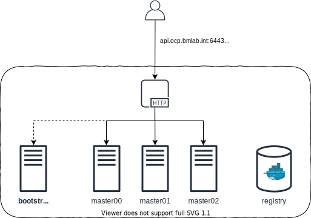

= Openshift 4

Deploy Openshift 4 on libvirt using Terraform without Internet access.

== Deploy cluster

Export your pull secret as Terraform variable.

[source,bash]
----
export TF_VAR_OCP_PULL_SECRET="$(pass redhat/opentlc/ocp/pull-secret)"
----

Deploy `+helper+` and `+bootstrap+` nodes.

[source,bash]
----
make
----

Wait until bootstrap is up and running to power on master nodes.

[source,bash]
----
virsh start ocp-master0{0,1,2}
----

Verify the Openshift cluster is correctly created.

[source,bash]
----
export KUBECONFIG="src/ignition/openshift/localhost/auth/kubeconfig"

oc get nodes
----

Shutdown bootstrap node.

[source,bash]
----
virsh shutdown ocp-bootstrap
----

== References

- https://docs.openshift.com/container-platform/4.3/welcome/index.html